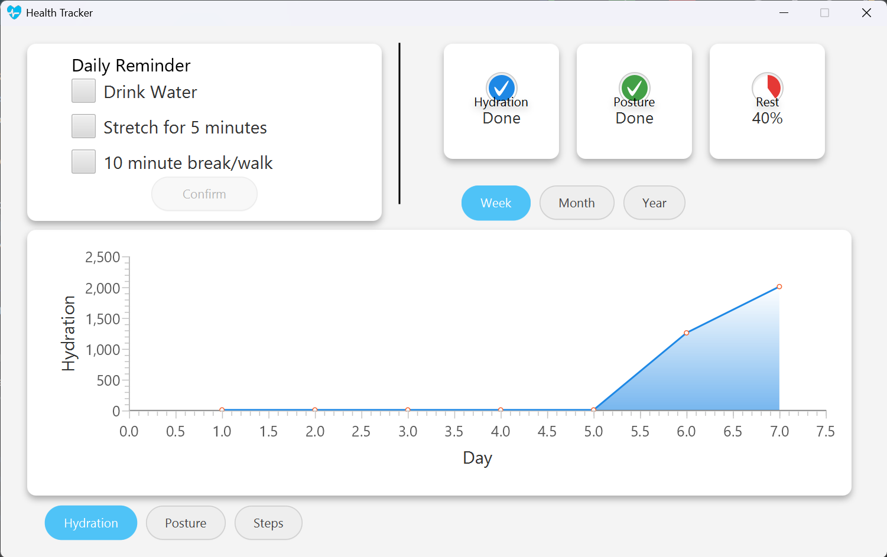
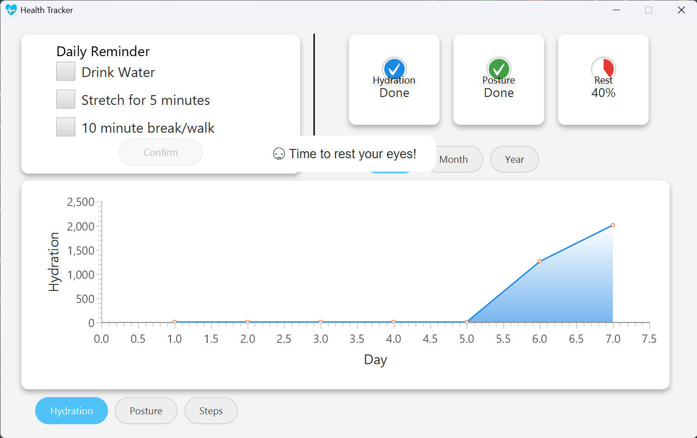

# 💻 Desktop Health Tracker

A simple and clean desktop application which tracks hydration, posture, and rest. Built using *JavaFX*, this app displays health stats on an interactive dashboard and reminds you throughout the day to stay on track.

---

## 🚀 Features

- 🔔 *Smart Reminders*  
  Periodic notifications for:
    - 💧 Drinking water
    - 🧘‍♂ Stretching your body
    - 👁 Resting your eyes

- 📊 *Health Tracking Dashboard*
    - Tracks hydration level (in ml), posture sessions (number of stretches), and steps (mocked data for consistency).
    - Visually represents progress using interactive *AreaCharts* and *circular progress rings* for each category.
    - Switchable views for each attribute via custom toggle buttons.

- 🗣 *Bonus Features*
    - Voice alerts for reminders.
    - Smooth animated popups for goal-related notifications.

---

## 🛠 How It Works

1. *Tracking System*
    - *Hydration*: You receive reminders to drink water. Each confirmation updates your progress toward a daily goal (e.g., 2500ml).
    - *Posture*: Reminders to stretch periodically, tracked in discrete sessions.
    - *Rest*: Periodic reminders to take eye breaks, internally logged based on time and linked to mock step values.

2. *Daily Data Persistence*
    - Each day’s data is stored in an *SQLite database* (health.db).
    - If an entry already exists for today, it is *updated dynamically*.
    - Otherwise, a new row is inserted, ensuring accurate historical tracking.

3. *User Interface*
    - The UI uses *JavaFX* with modern CSS styling.
    - Each category is presented in its own stylized panel with a *circular progress indicator* overlay.
    - The application starts minimized and operates silently unless a reminder is triggered.

---

## 🐞 Known Issues

- ⚠ *Notifications after goal completion*:  
  Despite finishing your daily goal (e.g., 2500ml water), reminders may still appear. This is a known logic bug currently being addressed.

- 🔄 *UI Responsiveness*:  
  Some popups may briefly overlap or queue unexpectedly when multiple goals are met in quick succession.

---

## 📦 Technologies Used

- Java 17+
- JavaFX 20
- SQLite (via JDBC)
- Custom CSS Styling

---

## 🧪 Future Improvements

- ✅ Fix notification suppression after goal completion
- 🔁 Add option to reset daily progress manually
- 📈 Enable long-term graph views (weekly/monthly trends)
- 🕹 Add settings panel for customizing reminder intervals and goals

---

## 📸 Screenshots

### Image showcasing the UI

### Image showcasing the notifications

---

## 📄 License

This project is for educational purposes. You are welcome to modify and use it freely.
This project is licensed under the [MIT License](./License).

---

## 🙌 Author

Developed by our team 💪
- Justin Joseph (lead)
- Gokila
- Aashish B Kumar
- Naila Afsal
- Chaithanya